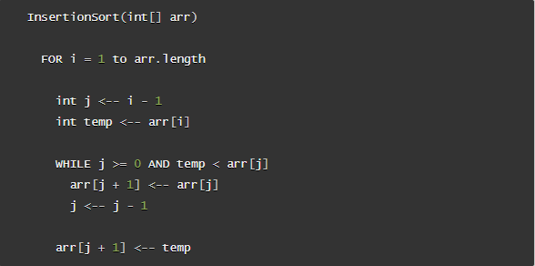
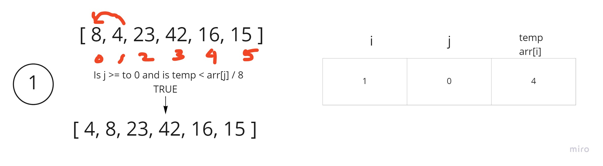
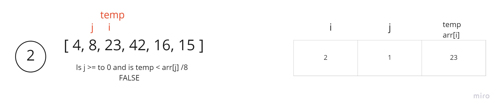
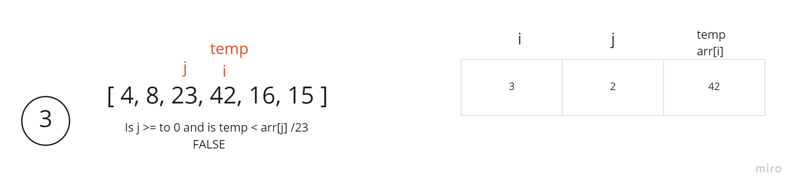
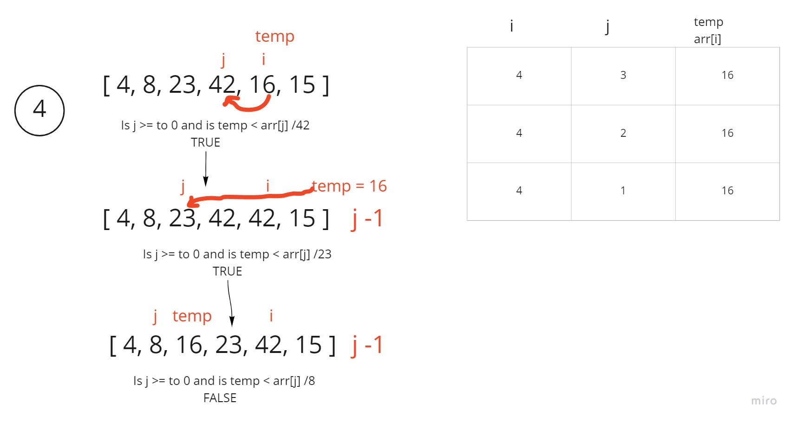

# Insertion Sort

Insertion sort is sorting algorithm. The array is split between a sorted side and a unsorted side. We interate through the array one value at a time. We check if the value against all the value before it to see if it's less than any of them and place it at the proper index.

## Psuedcode

## Trace

Sample Array: [8,4,23,42,16,15]

### Pass 1:

In the first pass, we start to compare the the `temp` value against the `arr[j]`. The `j variable` will always start off 1 less than the `i variable` and we always compare if the value at the `j index` is greater than the `temp` value which at the start is assigned to value at the `i index`. If this is true we go ahead and change the value at `arr[j + 1]` to equal `arr[j]`, then subract 1 from j. As long as j is greater than or equal to 0, we continue the while loop. In this pass j is less than 0, so we get out of the while loop and assign temp to the where `j` was at at last which is `j + 1` and this is where the first pass ends.

### Pass 2:

We increment `i` by 1 and in turn `j` also increments by 1. Temp assgined to `arr[i]`. Check if `temp < arr[j]`, since 23(temp) is not less than 8(arr[ j ]) we do not enter the while loop. And we assign `arr[j + 1]` equal to `temp`.

### Pass 3:

We increment `i` by 1 and in turn `j` also increments by 1. Temp assgined to `arr[i]`. Check if `temp < arr[j]`, since 42(temp) is not less than 23(arr[ j ]) we do not enter the while loop. And we assign `arr[j + 1]` equal to `temp`.

### Pass 4:

The fourth pass now compares the value of `arr[i]` which is 16 against the the values we've already iterated through and move 16 to the left of the array until we find a value that is less than 16 and insert in at the current location.

### Pass 5:

This last iteration we move 15 all the way to the left until we find something less than 15. Then we reach the end of our for loop.

## Efficiency

Time: O(n^2)

- Since we have a loop within a loop, this would be the worst case scenario

Space: O(1)

- the array is being sorted in place, and no additional space is being created.
