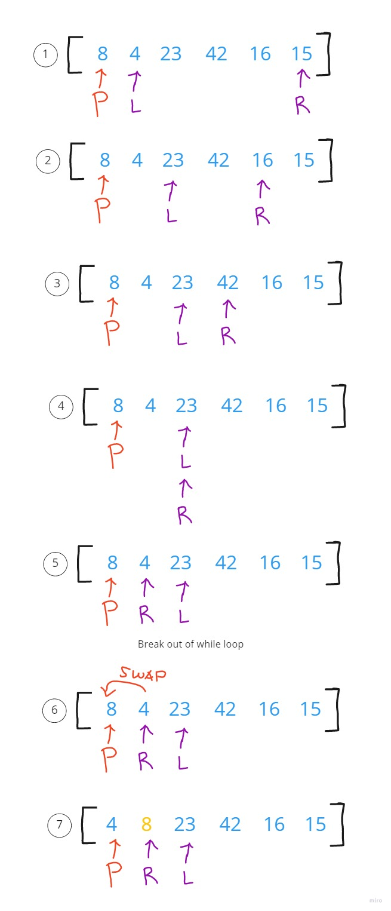
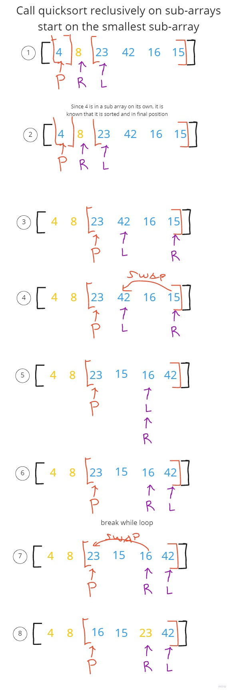

# Quick Sort

A divide and conquer algorithm. It picks an elemet as a pivot and partitions the given array around the picked pivot. Many different versions of quick sort pick the pivot element in different ways.

1. Always pick first element as pivot
2. Always pick last element as pivot.
3. Pick a random element as pivot.
4. Pick median as pivot.

## Psuedcode

```
ALGORITHM QuickSort(arr, left, right)
    if left < right
        // Partition the array by setting the position of the pivot value
        DEFINE position <-- Partition(arr, left, right)
        // Sort the left
        QuickSort(arr, left, position - 1)
        // Sort the right
        QuickSort(arr, position + 1, right)

ALGORITHM Partition(arr, left, right)
    // set a pivot value as a point of reference
    DEFINE pivot <-- arr[right]
    // create a variable to track the largest index of numbers lower than the defined pivot
    DEFINE low <-- left - 1
    for i <- left to right do
        if arr[i] <= pivot
            low++
            Swap(arr, i, low)

     // place the value of the pivot location in the middle.
     // all numbers smaller than the pivot are on the left, larger on the right.
     Swap(arr, right, low + 1)
    // return the pivot index point
     return low + 1

ALGORITHM Swap(arr, i, low)
    DEFINE temp;
    temp <-- arr[i]
    arr[i] <-- arr[low]
    arr[low] <-- temp
```

## Trace

Sample Array: [8, 4, 23, 42, 16, 15];

The while loop condition is as long as left index < right index.
When passing through the array, quick sore will check if `left > pivot AND right < pivot` and if it is it will swap the left and right pointers. After checking that it will check if `left <= to pivot` then increment left by 1. Then will check the same for the right, if `right >= pivot` decrement right by 1.

### First Pass



### Second Pass



It will keep recursively calling quicksort on the sub arrays until the aray is sorted.
